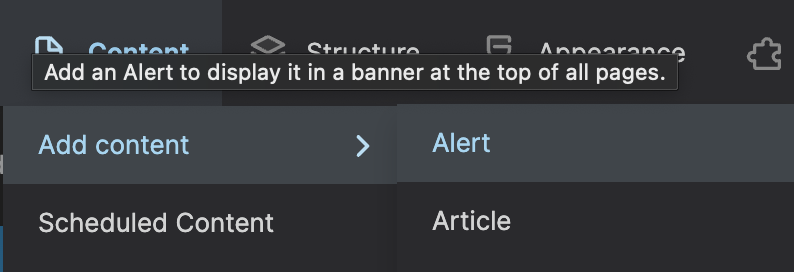
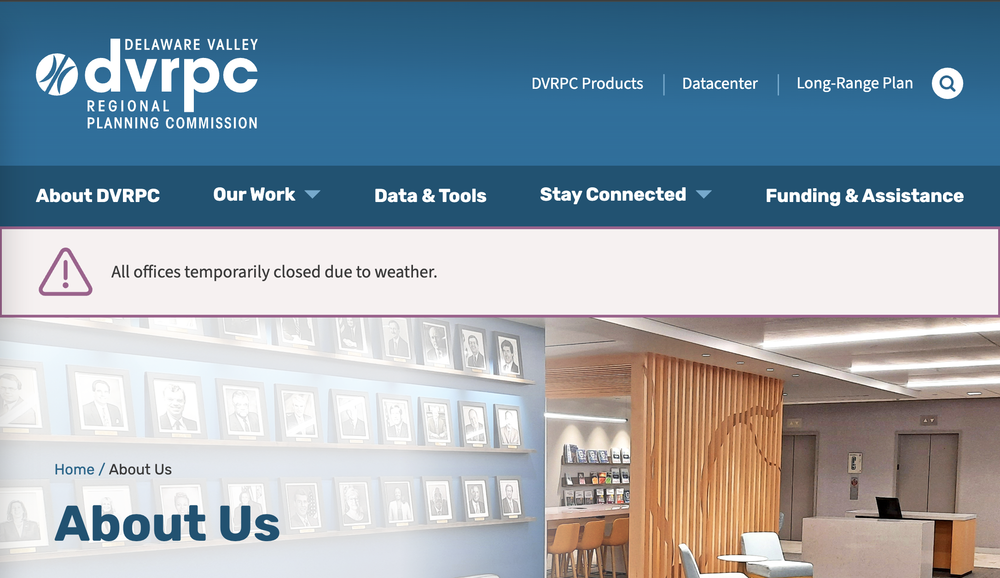

An Alert[^1] is a Content Type with a single text field that will be displayed on **ALL** pages of the website once it is published.

You can add an Alert by selecting it from the Add Content Submenu of Content in the Admin Toolbar. 

Editing an Alert

Demo: About us Page with the Alert message set to published. 

[^1]: [Storybook - Alert Component](https://dev-dvrpc.pantheonsite.io/storybook/?path=/docs/molecules-alert--alert)