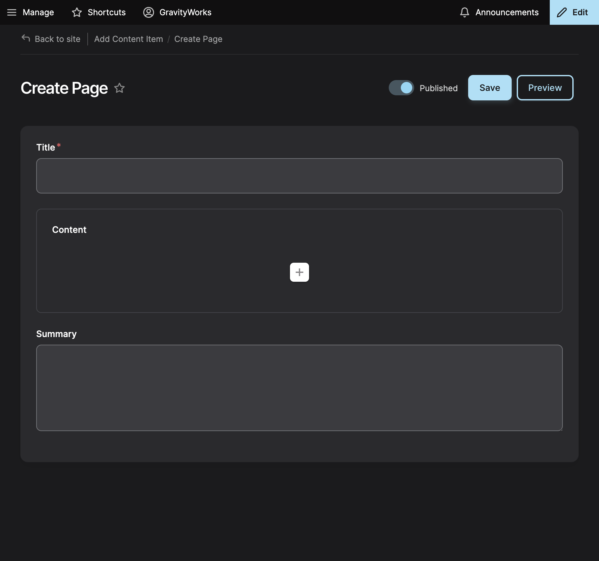

Page nodes are used to build most of the site.  Page nodes use layout paragraph types (a.k.a. components) and allow editors to add content in multiple columns using stylized paragraphs. In Drupal, a Paragraph Type is a section of content with a specific layout, such as an Accordion  or Callout. 

1. To add a page you select Content -> Add Content -> Page from the menu.

2. Enter a Title[^1] for your Page. This should be concise and descriptive.

3. Clicking on the (+) item in the middle of the content block [prompts the user with set of paragraphs they can inject](../models/content-builder.md).

4. The summary field is for long-form descriptions for page usage.

Click Preview to view your Page with the content section rendered completely.

After you are done you can click Save.

There is also a <a href="https://dev-dvrpc.pantheonsite.io/test-page" target="_blank">Paragraph test page</a> with examples and content.

[^1]: Required