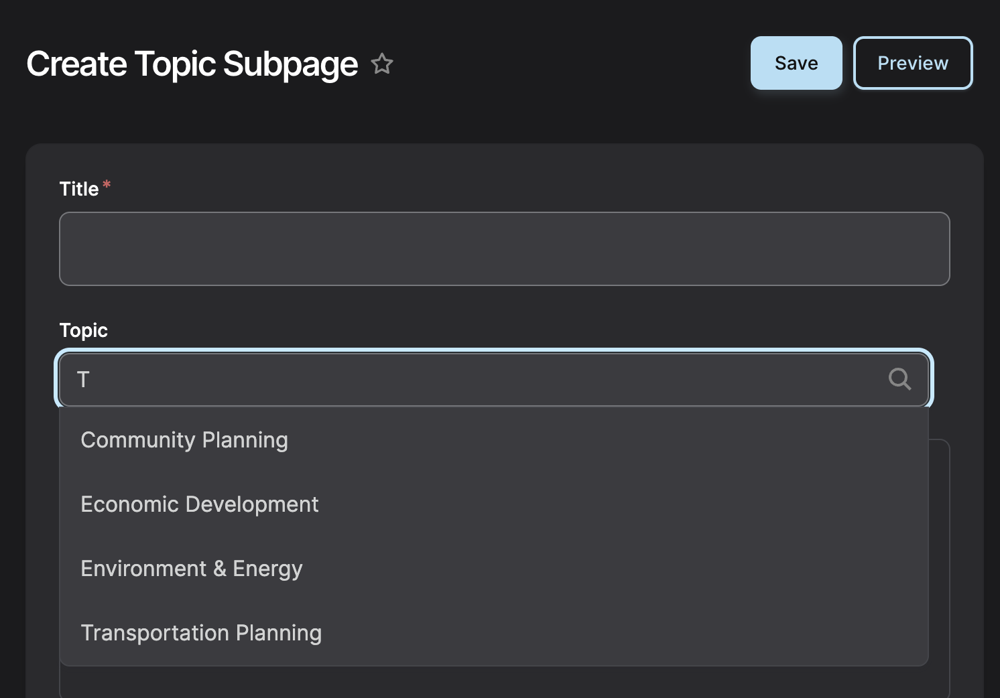

<!-- <a href="https://dev-dvrpc.pantheonsite.io/subtopic-demo" target="_blank">Demo Page</a> -->

Topic Subpages represent specific focus areas within each major Topic.

For example:

- Transportation Planning → includes subtopics like Safety, Transit, or Freight
- Safety highlights DVRPC’s focused efforts, such as the Regional Safety Task Force and related initiatives

These pages provide a more detailed view into key areas of work within each Topic.

### How Topic Subpages Work
Topic Subpages are automatically connected to their parent Topic page.

- Each Subpage is assigned to a single Topic
- Subpages are automatically displayed on the corresponding Topic page
- This relationship cannot be manually overridden

This ensures a consistent structure across the site and keeps Topic pages organized.

### What Topic Subpages Are Used For
Use Topic Subpages to:

- Highlight priority focus areas within a Topic
- Group related initiatives, programs, or strategies
- Provide deeper context around a specific subject area
- Think of them as “chapters” within a broader Topic.

### What You Can and Cannot Control

You Can:

- Create and manage Topic Subpages
- Define their content and messaging
- Sidebar Content and Related Resources
- Assign them to the appropriate Topic

You Cannot:

- Manually control whether a Subpage appears on a Topic page
- Reorder or override how Subpages display within the Topic page
