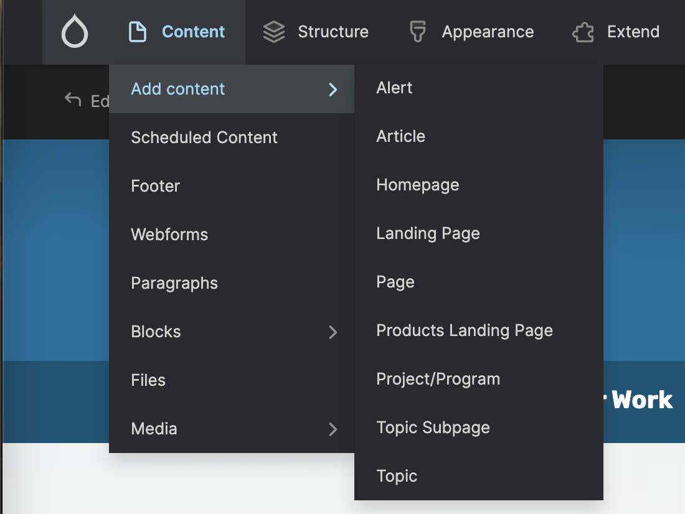
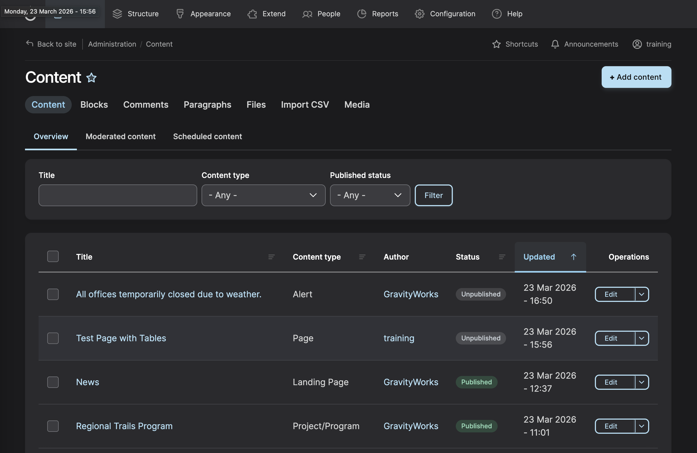

>**Did you know?**  
>_In Drupal, a single piece of content is called a node. A node can be a page, a topic, a project/program, or one of many other options._

### First Steps 

Rollover the Content link in the administrator toolbar to see a list of all nodes types on the website. You can also get to the Content List by going to <a href="https://dev-dvrpc.pantheonsite.io/admin/content" target="_blank">Content Administration</a> or clicking on the Content Menu link directly.

_Selecting any of the items from the Add content submenu will take you into a new instance of that content type._

### Content List

### Filtering the Content List

You can limit the content list to find a specific type or piece of content. On the Content page, use the filters in the show only items where box. 

The status filter allows you to find Nodes with certain settings, such as published or unpublished. 

The type filter allows you to select certain types of Nodes, such as [Page](./content-types/page.md) or [Project/Program](./content-types/project-program.md).

Once selections have been made, click the Filter button to apply to these selections. The page will reload to show only Nodes that match your selection. 

To return to the full list of Nodes, click the Reset button to clear any preselected filters. 

### Viewing Content
To see a Node, go to the Content link in the administrator toolbar and click on the name of the content that you want to view. Alternatively, you can navigate to the Node using your site’s public navigation if the content you are seeking is listed in your menu structure. 

### Editing Content
There are two ways to get to the edit screen for a Node:
Go to Content in the administrator toolbar, find the Node you want to edit, and click the Edit link for that piece of content.
Or, navigate to the content using your site’s public navigation. Once the Node is opened, click the Edit tab near the top of the page.
Once on the edit screen, changes can be made to the content itself. Make sure to click the Save button at the bottom of the edit screen to save your changes! 

### Deleting or Unpublishing Content
There are two ways to remove a Node from your website. Before removing a Node, consider setting it to unpublished, which will remove it from public view but keep the content on the website and can easily be restored to published later on. 

To **delete** content:
Go to Content in the administrator toolbar, find the Node on the list and select its respective checkbox. On the bottom the black menu with “X item(s) selected” appears. You can choose Delete content from this dropdown and then Apply to selected items

To **unpublish** content:
Go to Content in the administrator toolbar, find the Node on the list and select its respective checkbox. On the bottom the black menu with “X item(s) selected” appears. You can choose Unpublish content from this dropdown and then Apply to selected items

Go to node that you would like to unpublish and uncheck the Published checkbox and save then Save.