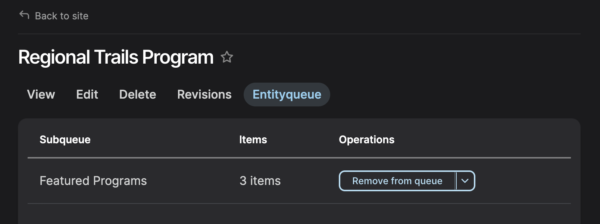
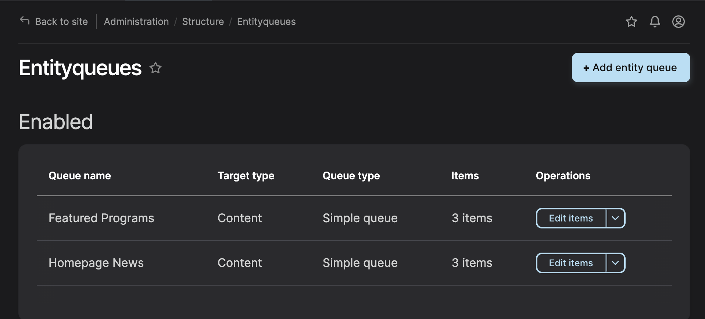

<a href="https://dev-dvrpc.pantheonsite.io/admin/structure/entityqueue" target="_blank">Entityqueues</a> allow content editors to create curated lists of content in Drupal. Instead of displaying items automatically based on tags or topics, an entityqueue lets an editor choose exactly which items should appear in a content block, section, or page—and in what order.

Entityqueues are helpful when content needs to be intentionally featured, prioritized, or manually maintained.

There are two ways editors interact with entityqueues, depending on what they’re trying to do:
    
1. Add or Remove Content (Most Common)

    Editors can add or remove a page from an entityqueue directly within that node[^1].

    

    How:

    - Open the node you want to edit
    - Navigate to the Entityqueues tab
    - Select or deselect the appropriate queue(s)

    Use this when:

    - You want to feature or remove a specific item
    - You’re working on a single page and deciding where it should appear

2. View and Manage the Full Queue

    Editors can also manage the entire list of items in an entityqueue.

    

    How:

    - Go to: Structure → Entityqueues
    - Select the queue you want to manage
    - View all items in the queue
    - Reorder items (if ordering is enabled)
    - Remove items from the list

    Use this when:

    - You want to review everything in a queue
    - You need to reorder items
    - You’re managing a curated section holistically

[^1]: The Entityqueue tab is only available on the Article, and Project/Program Content Types