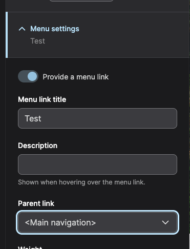
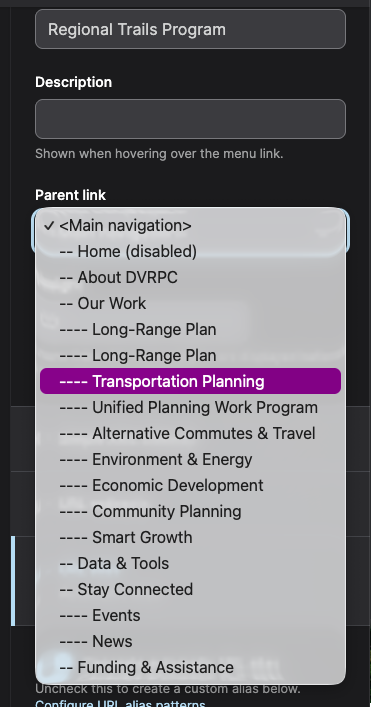

Pages can be added to the Main Menu at time of page creation by checking the ‘Provide a menu link’ checkbox in the Menu Settings section on the right side of the node. 
Upon checking the box, the ‘page title’ will automatically populate in the Menu link title field. It can be manually edited as needed if the menu title needs to be different from the page title. 

The position of the menu item can also be adjusted by selecting the proper Parent link from the dropdown field.

