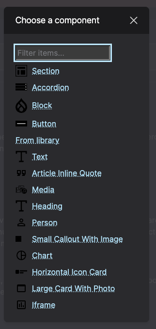

**[Sections](../models/section.md)** are very important. Whenever you are placing content such as Text, Callouts, or Accordions on the page, you must first place a Section to house them. 
The Sections hold much of the standard styling that will make the padding, spacing, outlining, etc on the page look correct.

**Accordion**: This paragraph type is used to tuck detailed information under the title of a topic. These are often used for Frequently Asked Questions where a question will appear as the Accordion Label and the answer to the question is tucked in the Accordion Content and displayed when a user clicks on the question. Each Accordion paragraph type can support one accordion, meaning if more than one accordion is needed, two or more individual Accordion paragraph types will be needed.

**Block**: A Block paragraph type are specially made paragraph types for one-of-a-kind display information. The most common usage will be for injecting DVRPC-created React Modules into your Node Content.

**[Text](../models/text.md)**: This is the standard paragraph type where the majority of the text will go. These display text paragraphs and can include images, in-text links, and paragraph styling such as headers, bold, and italic texts.

**Media**: This paragraph type allows documents, images, or remote videos to be displayed. Media can be added in the Media Tab in the content admin. 

**[Additional Components](../paragraph-types/report.md)**: Full list of custom components.

