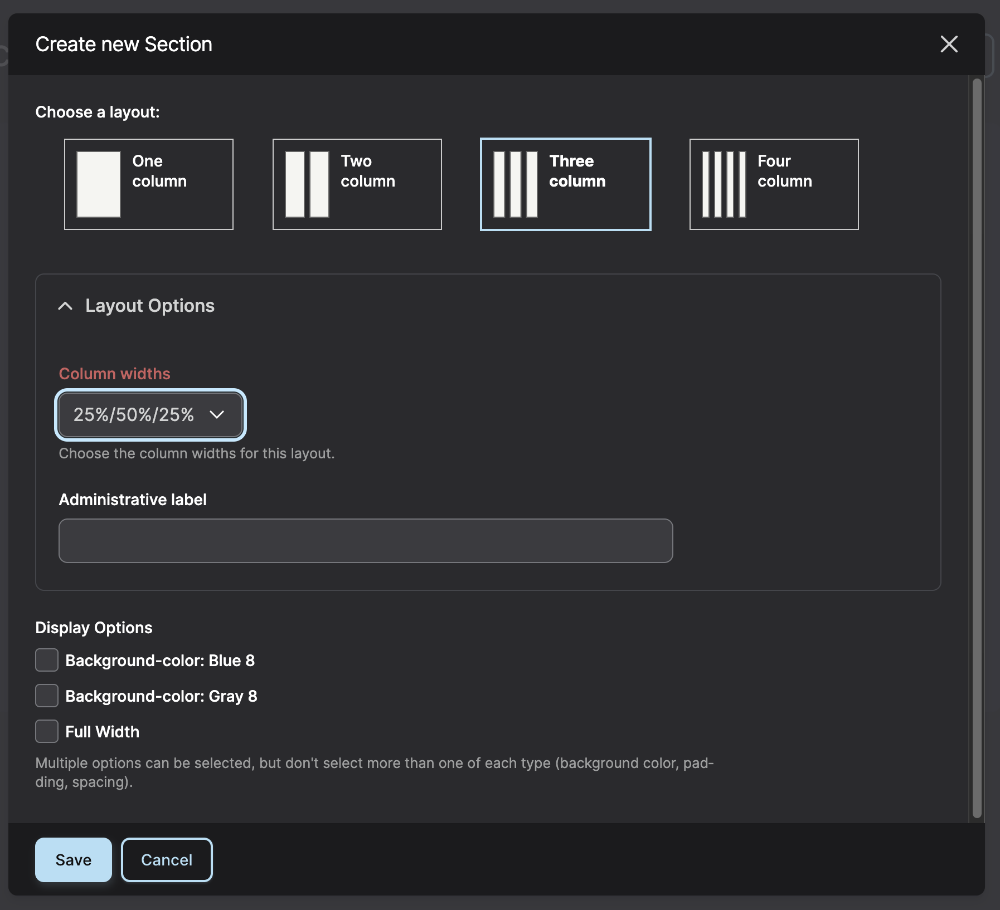

**Layout**: Allows you to divide your section into columns and insert paragraph types such as text and images into columns on your page. For sections with general information, select One Column.

**Layout Options**: In "One Column" and "Four Column" it allows you to set an Administrative Label.
For "Two Column" and "Three Column" you also get a dropdown with preset column width percentages.

**Display Options**: There are various options for background and foreground colors, centering, padding, vertical spacing, and bleed.