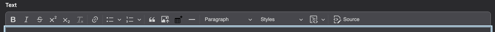
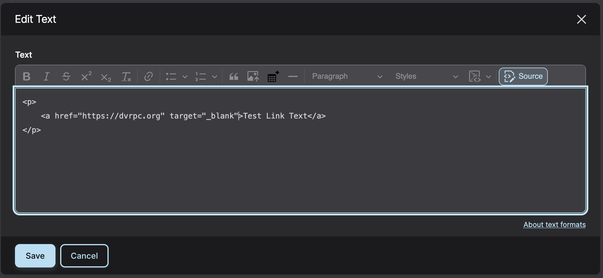
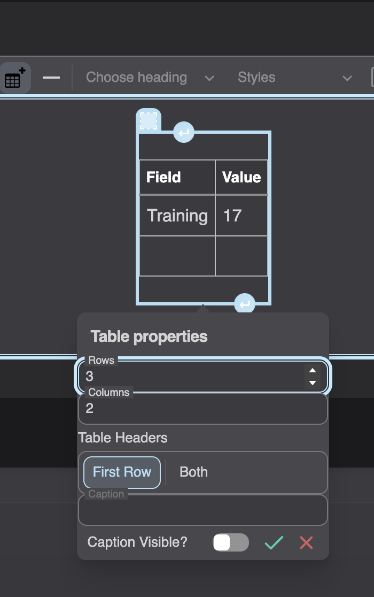

We use a WYSIWYG editor for many fields within components. 

### Usage

#### Formatting
Basic Text Formatting

 - Bold, Italicize, Strike-through, Superscript, Subscript

Remove Formatting

- Highlight text and remove all formatting (removes HTML elements leaving only content).

Hyperlink

- To open links in a new window you will need to edit the link in source view and add the attribute `target="_blank"`

### Lists

Unordered List

- Item 1

- Item 2

Ordered List

1. Item 1

2. Item 2

> Blockquote and Indent

Image

 - Upload image from your computer.

Table

Horizontal Rule

 - Line Separator

Text Size

- Wraps text with either `
` or `<h#>` elements.

Styles

 - 4 Built-in styles

Code Block

 - Used to show unrendered code content in a monospace font.

Source View

 - Switch from HTML WYSIWYG to unrendered HTML code.
