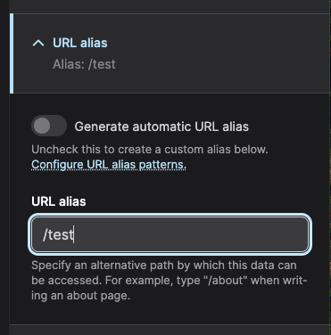
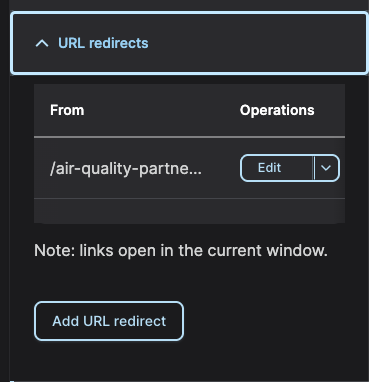
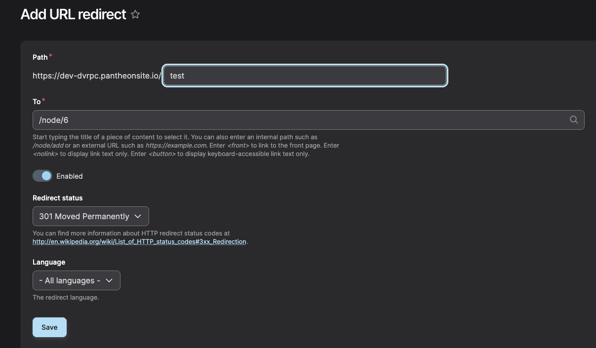

There are a few ways to add/edit aliases and redirects. 

## URL Alias

Usage: URL aliases are used to provide a user-readable URL path.

Example: From: /campaign-archive -> To: /node/12

1. You can update the respective Content Node and update the URL Alias field.
2. Go to the <a href="https://dev-dvrpc.pantheonsite.io/admin/config/search/path" target="_blank">URL Alias admin panel</a> and either click + Add alias, or edit existing aliases from the list.

### URL Alias Field on Content Node

In the right column of your content editor there is a section for URL alias. 
Choosing Generate Automatic URL Alias the system will try to generate a relative url based on your Content Node Title field.
For example a Page labeled "New Programs Available in the 3rd Quarter" could be generated as "/new-programs-available-in". 
You can specify the exact alias you want to use.

## Redirects

Usage: Redirects are used to provide multiple URL paths that redirect to a single URL. 

Commonly used for marketing campaigns.

Examples:

- From: /campaignQ1 -> To: /campaign-archive
- From: /campaignQ2 -> To: /campaign-archive
- From: /campaignQ3 -> To: /campaign-archive

### Redirects Field on Content Node

In the right column of your content editor there is a section for Redirects. 
Here you can edit existing redirects, or add new ones.

#### Adding Redirects
Go to the <a href="https://dev-dvrpc.pantheonsite.io/admin/config/search/redirect" target="_blank">Redirect admin panel</a> and either click + Add redirect, or edit existing redirects from the list.

