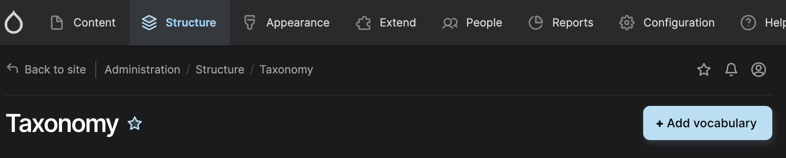
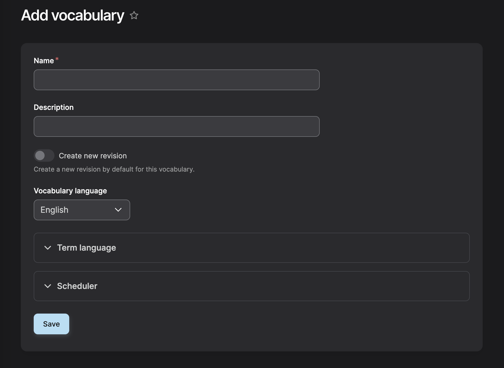
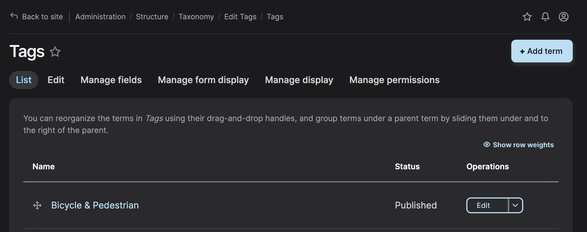
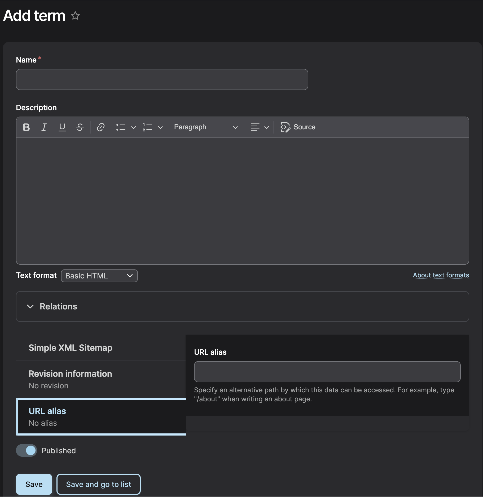

In the Drupal ecosystem, Taxonomy serves as the foundational framework for classifying, grouping, and relating content across a website.

You can get to Highlighting the Structure menu and clicking on Taxonomy or this <a href="https://dev-dvrpc.pantheonsite.io/admin/structure/taxonomy" target="_blank">Taxonomy Admin</a> direct link.

### Creating A Vocabulary
A vocabulary acts as a category for your taxonomy terms. 

Click + Add vocabulary

Enter a Name and Description and click Save.

|Fields|Type|
|-|-|
|Name  | Text [^1]  |
|Description|Text Field|
|Language|Dropdown|

### Adding Terms

Click + Add term

|Fields|Type|
|-|-|
|Name  | Text [^1]  |
|Description|HTML Text|

Enter a Name and Description and click Save.

That term will be added to the respective taxonomy vocabulary.

[^1]: Required