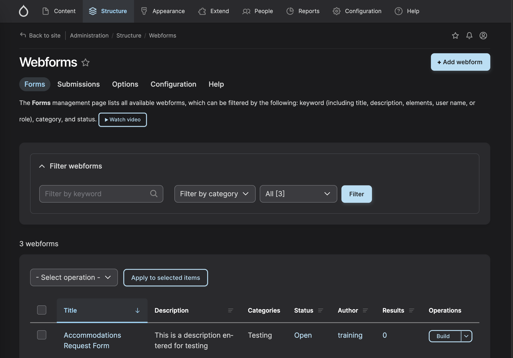
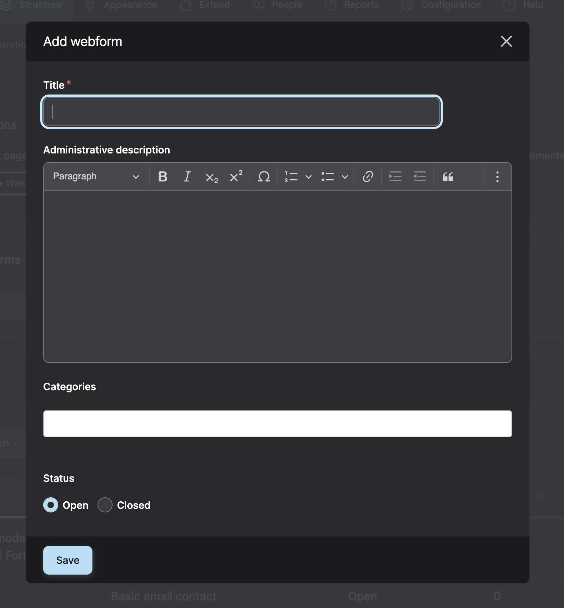
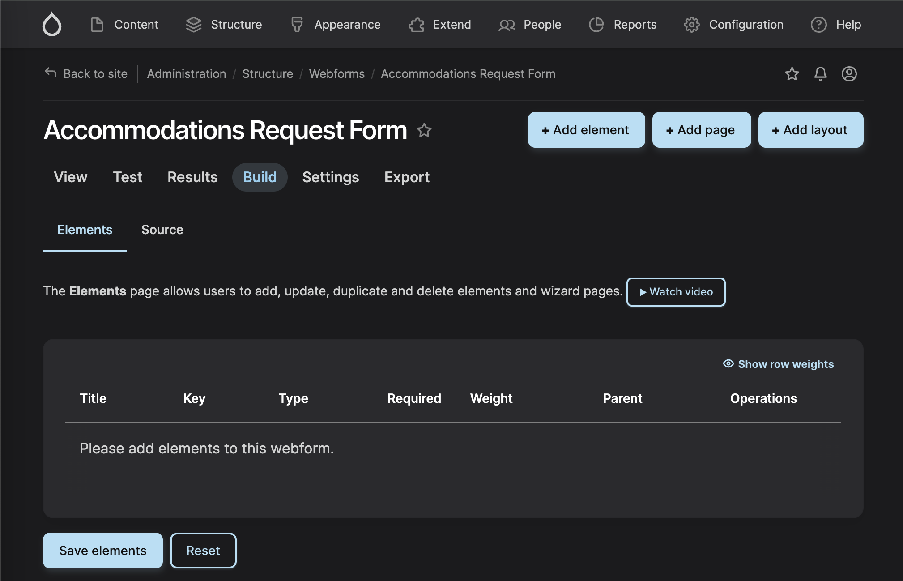
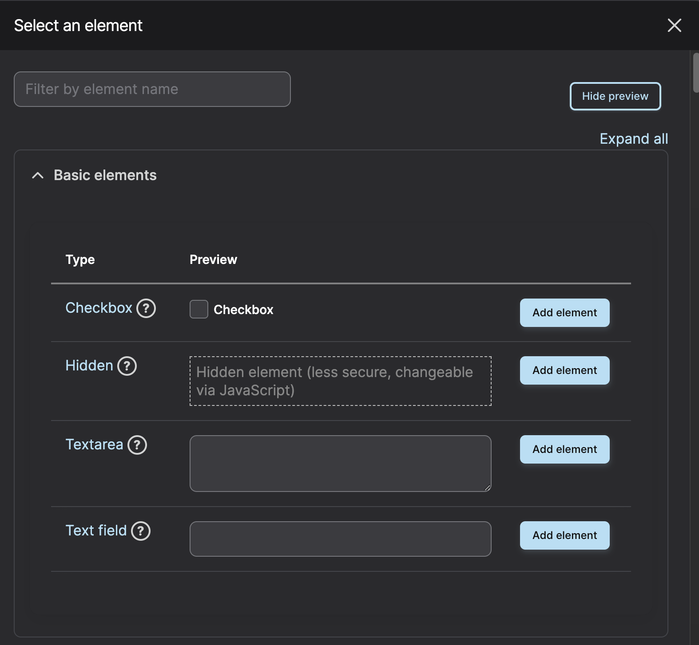
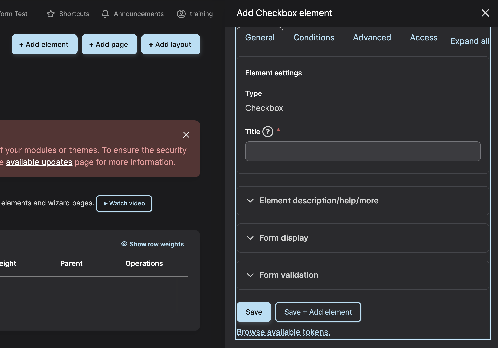
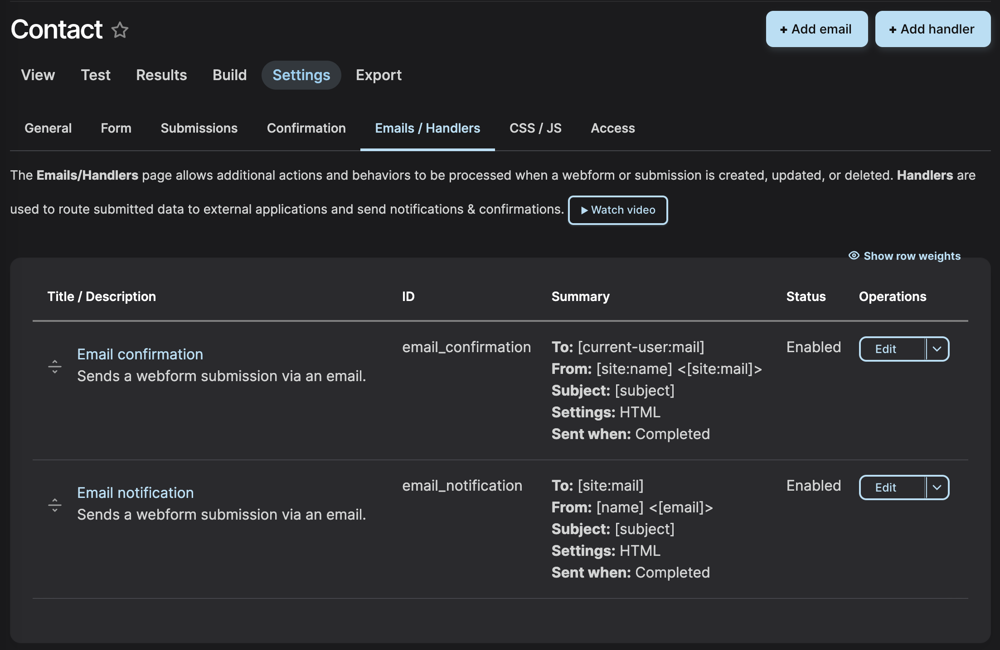
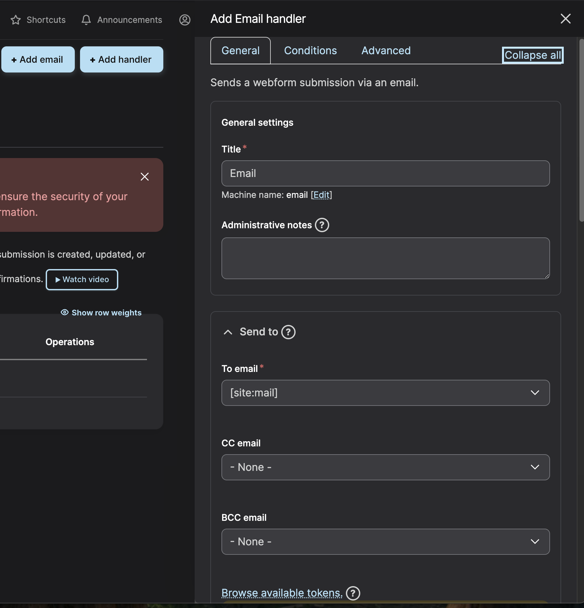
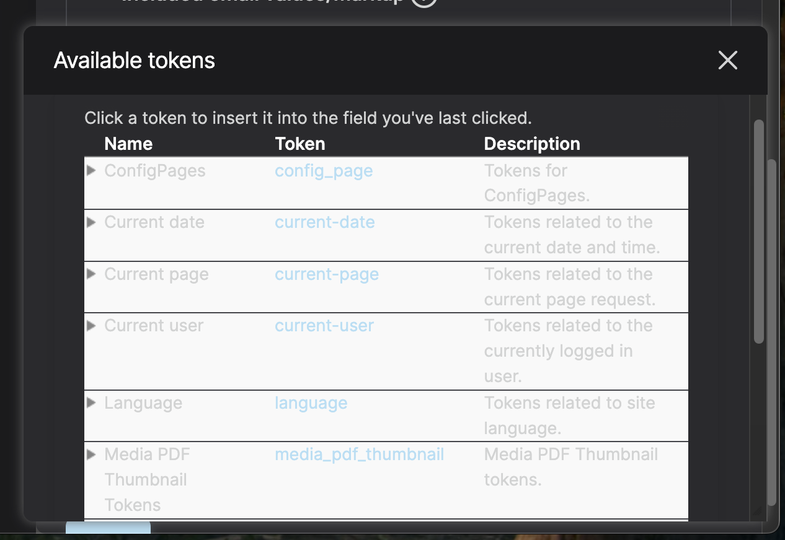

### Finding Webforms
You can get to the Webforms administration a few different ways:

1. Under the Content Menu -> Webforms. 

2. Under the Structure Menu -> Webforms. 

3. Or this link to [Webforms Admin](https://dev-dvrpc.pantheonsite.io/admin/structure/webform). 

### Create a Webform [^1]

- Click the + Add webform button.

- Enter a Title and optional administrative description. (Ignoring Categories for Now)
- Set the Status to Open to make the form available to users.
- Click Save

### Build your Webform

After saving the basic form, you will be directed to the Build tab.

- Click the + Add element button. 
- A window will pop up with a list of available field types (called "elements" in Webform).
- Select the desired element type (e.g., "Text Field", "Email", "Checkbox") by clicking its corresponding Add element button.

- Configure the element settings in the side panel that appears. You can set a Title, add a description, or mark the field as Required.

- Click Save to add the element to the form.
- Repeat this process for all necessary fields. You can reorder elements using drag-and-drop.
- Click Save elements after adding all fields.

[^1]: There is not a menu item for directly creating a webform. This is due to the Webform create component. It loads in a popup modal without changing the url of the site.

>Please note: You can select which user roles are available to receive webform emails by going to the [Webform module's admin settings form](https://dev-dvrpc.pantheonsite.io/admin/structure/webform/config/handlers?destination=/admin/structure/webform/manage/training_webform_test/handlers
).

### Emails and Messaging

You will also need to add event messaging for webform submissions. 

Selected Webform -> Settings Tab -> Emails/Handlers Tab

Choose + Add email

Decide whether this is:

- A message to the team when a submission is entered
- A message to the user letting them know the submission was entered.

Message:

- Subject
    - Webform submission form
- Body Dropdown
    - Use Default.

The body field allows use of tokens, that will dynamically add to your message content:

